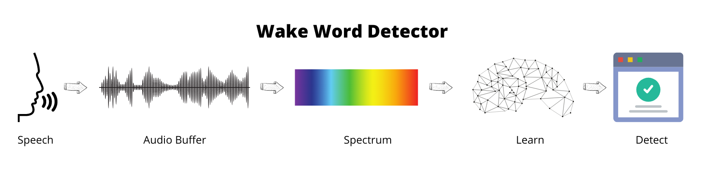

# Table of Contents
- [Background](#background)
- [Introduction](#introduction)
- [Implementation](#implementation)
    - [Preparing labelled dataset](#preparing-labelled-dataset)
    - [Word Alignment](#word-alignment)
    - [Fix data imbalance](#fix-data-imbalance)
    - [Extract audio features](#extract-audio-features)
    - [Audio transformations](#audio-transformations)
    - [Define model architecture](#define-model-architecture)
    - [Train model](#train-model)
    - [Test Model](#test-model)
    - [Inference](#inference)
        - [Using Pyaudio](#using-pyaudio)
        - [Using web sockets](#using-web-sockets)
        - [Using onnx](#using-onnx)
- [Conclusion](#conclusion)
- [Enhancements](#enhancements)

# Background
Personal Assistant devices like Google Home, Alexa and Apple Homepod, will be constantly listening for specific set of wake words like “Ok, Google” or “Alexa” or “Hey Siri”, and once these sequence of words are detected it would prompt to user for next commands and respond to them appropriately.

# Introduction
To create a open-source custom wake word detector, which will take audio as input and once the sequence of words are detected then prompt to the user. <br>

Goal is to provide configurable custom detector so that anyone can use it on their own application to perform operations, once configured wake words are detected.

# Implementation

## Preparing labelled dataset
Used [Mozilla Common Voice dataset](https://commonvoice.mozilla.org/en/datasets), 
- Go through each wake word and check transcripts for match
- If found then it will be in positive dataset
- If not found then it will be in negative dataset
- Load appropriate mp3 files and trim the silence parts
- save as .wav file and transcript as .lab file
- Code reference [fetch_dataset_mcv.py](train/fetch_dataset_mcv.py)
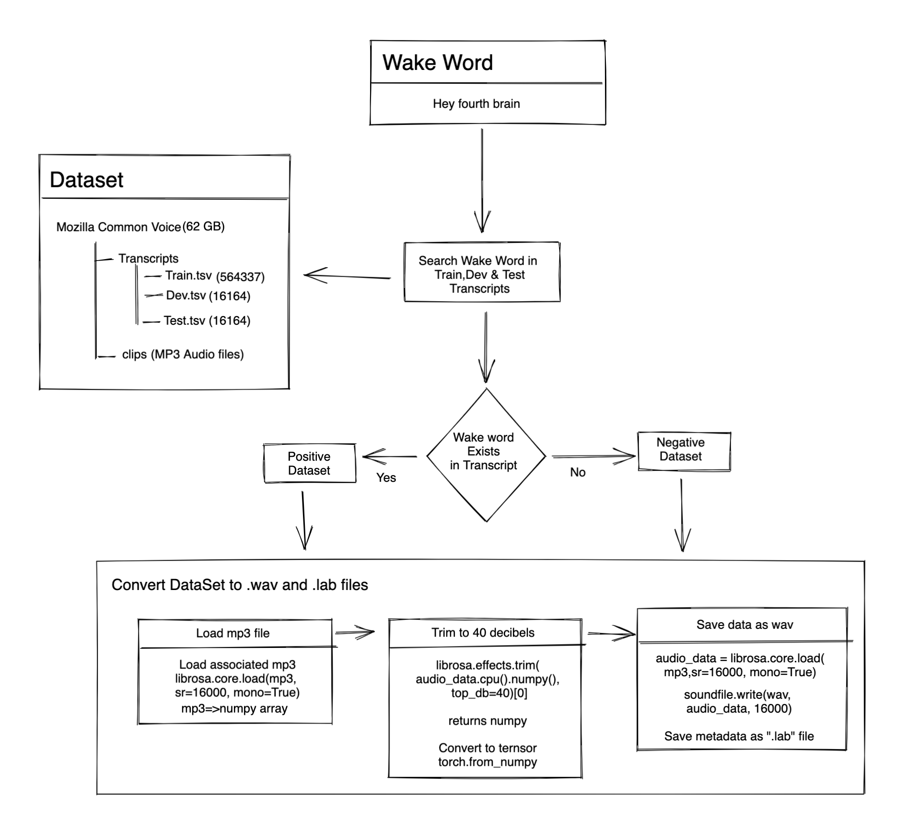

## Word Alignment
- For positive dataset, used [Montreal Forced Alignment](https://github.com/MontrealCorpusTools/Montreal-Forced-Aligner) to get timestamps of each word in audio.
- Download the [stable version](https://github.com/MontrealCorpusTools/Montreal-Forced-Aligner/releases)
    ```
    wget https://github.com/MontrealCorpusTools/Montreal-Forced-Aligner/releases/download/v1.0.1/montreal-forced-aligner_linux.tar.gz
    tar -xf montreal-forced-aligner_linux.tar.gz
    rm montreal-forced-aligner_linux.tar.gz
    ```
- Download the [Librispeech Lexicon dictionary](https://www.openslr.org/resources/11/librispeech-lexicon.txt)
    ```
    wget https://www.openslr.org/resources/11/librispeech-lexicon.txt
    ```
- Known issues in MFA
    ```
    # known mfa issue https://github.com/MontrealCorpusTools/Montreal-Forced-Aligner/issues/109
    cp montreal-forced-aligner/lib/libpython3.6m.so.1.0 montreal-forced-aligner/lib/libpython3.6m.so
    cd montreal-forced-aligner/lib/thirdparty/bin && rm libopenblas.so.0 && ln -s ../../libopenblasp-r0-8dca6697.3.0.dev.so libopenblas.so.0
    ```
- Creating aligned data
    ```
    montreal-forced-aligner\bin\mfa_align -q positive\audio librispeech-lexicon.txt montreal-forced-aligner\pretrained_models\english.zip aligned_data
    ```

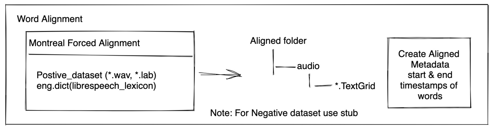
Generated textgrid file 
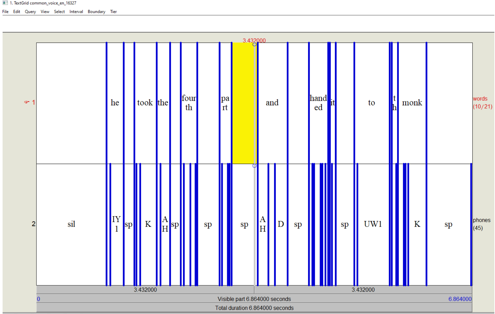

## Fix data imbalance
Check for any data imbalance, if the dataset does not have enough samples containing wake words, consider using text to speech services to generate more samples. 
- Used Google Text To Speech Api, set environment variable `GOOGLE_APPLICATION_CREDENTIALS` with your key.
- Used various speed rates, pitches and voices to generate data for wake words. 
- Code [generate_dataset_google_tts.py](/train/generate_dataset_google_tts.py)

## Extract audio features
- Below is how sound looks like when plotted on time (x-axis) and amplitude (y-axis)
    ```python
    import librosa
    sounddata = librosa.core.load("hey.wav", sr=16000, mono=True)[0]

    # plotting the signal in time series
    plt.plot(sounddata)
    plt.title('Signal')
    plt.xlabel('Time (samples)')
    plt.ylabel('Amplitude')
    ```
    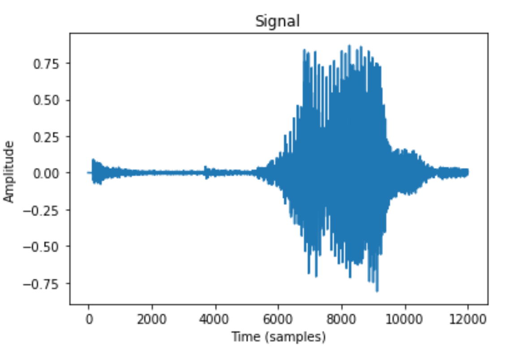
- When Short-time Fourier transform (STFT) computed, below is how spectrogram looks like
    ```python
    from torchaudio.transforms import Spectrogram
    spectrogram  = Spectrogram(n_fft=512,hop_length=200)
    spectrogram.to(device)

    inp = torch.from_numpy(sounddata).float().to(device)
    hey_spectrogram = spectrogram(inp.float())
    plot_spectrogram(hey_spectrogram.cpu(), title="Spectrogram")
    ```
    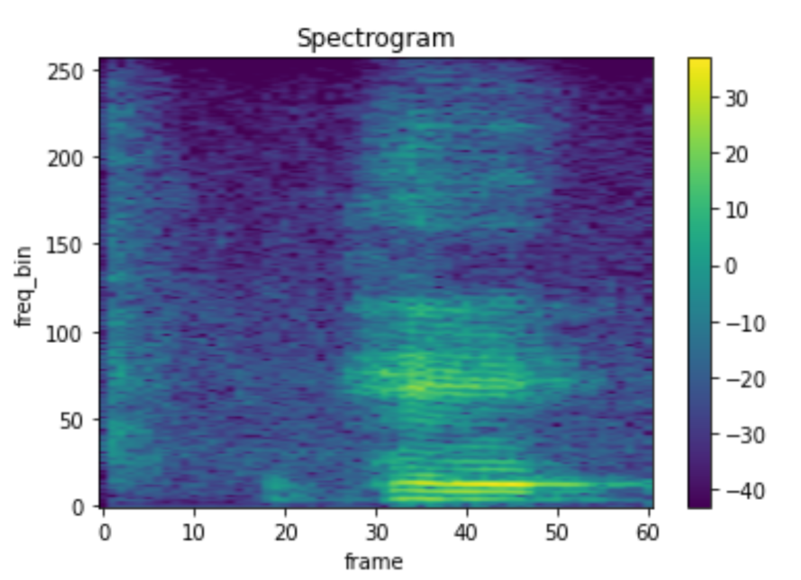
- A mel spectrogram is a spectrogram where the frequencies are converted to the mel scale.
    ```python
    from torchaudio.transforms import MelSpectrogram
    mel_spectrogram  = MelSpectrogram(n_mels=40,sample_rate=16000,
                                    n_fft=512,hop_length=200,
                                    norm="slaney")

    mel_spectrogram.to(device)
    inp = torch.from_numpy(sounddata).float().to(device)
    hey_mels_slaney = mel_spectrogram(inp.float())
    plot_spectrogram(hey_mels_slaney.cpu(), title="MelSpectrogram", ylabel='mel freq')
    ```
    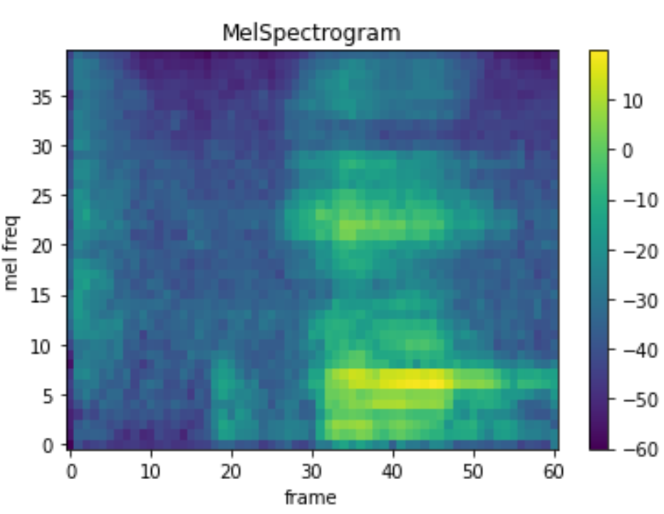
- After adding offset and taking log on mels, below is how final mel spectrogram looks like
    ```python
    log_offset = 1e-7
    log_hey_mel_specgram = torch.log(hey_mels_slaney + log_offset)
    plot_spectrogram(log_hey_mel_specgram.cpu(), title="MelSpectrogram (Log)", ylabel='mel freq')
    ```
    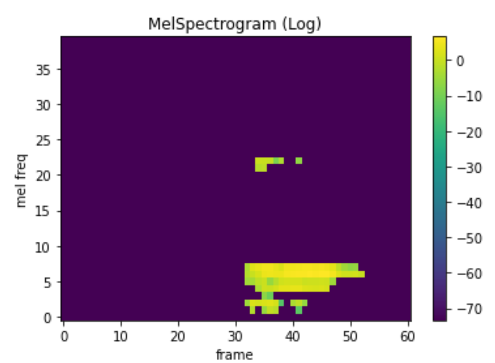

## Audio transformations
- Used [MelSpectrogram](https://pytorch.org/audio/stable/transforms.html#melspectrogram) from Pytorch audio to generate mel spectrogram
- Hyperparameters
    ```
    Sample rate = 16000 (16kHz)
    Max window length = 750 ms (12000)
    Number of mel bins = 40
    Hop length = 200
    Mel Spectrogram matrix size = 40 x 61
    ```
- Used Zero Mean Unit Variance to scale the values
- Code [transformers.py](train/transformers.py) and [audio_collator.py](train/audio_collator.py) <br>
    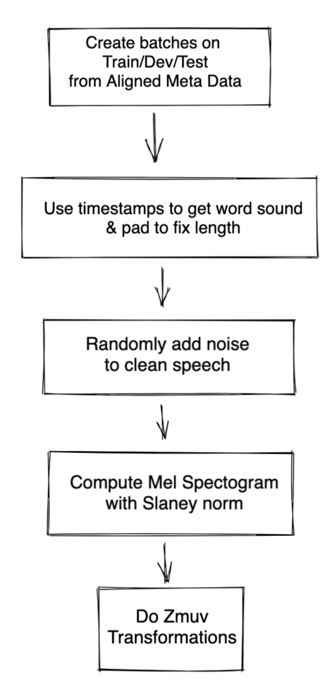

## Define model architecture
- Given above transformations, Mel spectrogram of size `40x61` will be fed to model
- Below is the CNN model used <br>
    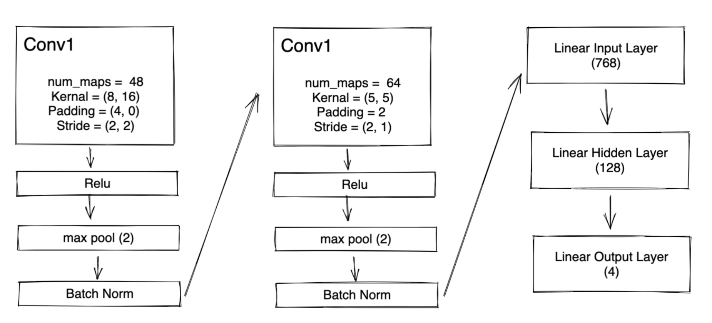
- Code [model.py](train/model.py)
- Below is the CNN model summary <br>
    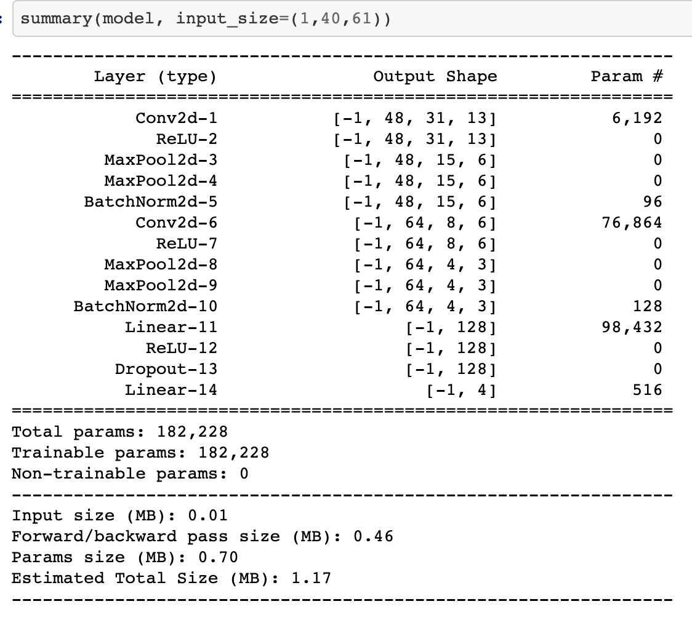

## Train model
- Used batch size as 16, Tensor of size `[16, 1, 40, 61]` will be fed to Model
- Used 20 epochs, below is how the train vs validation loss looks like without noise
    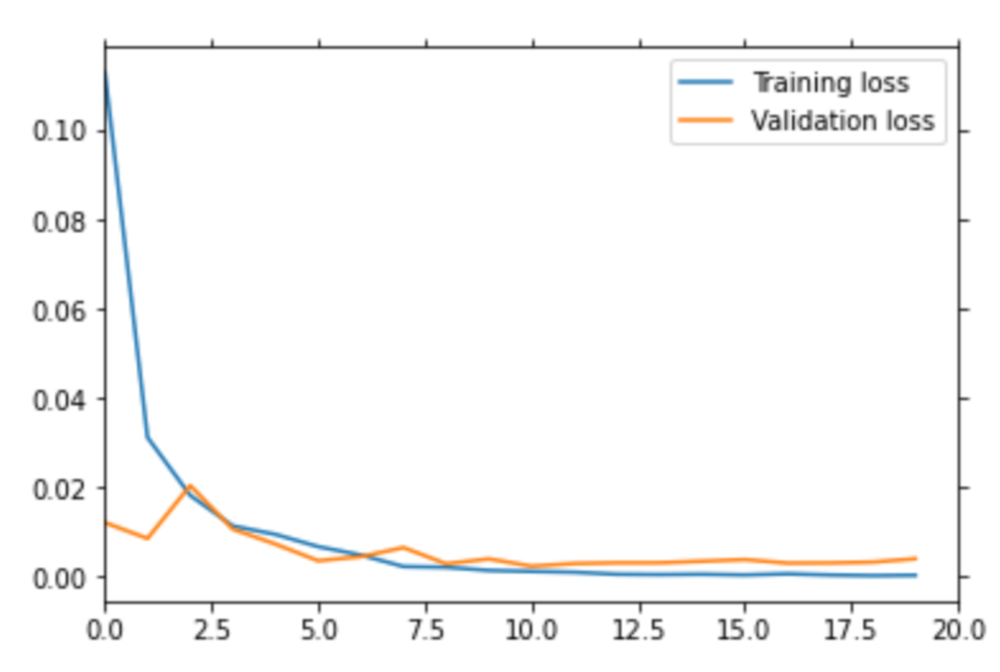
- As you can see, without noise, there is overfitting problem
- Its resolved after adding noise, below is how the train vs validation loss looks like <br>
    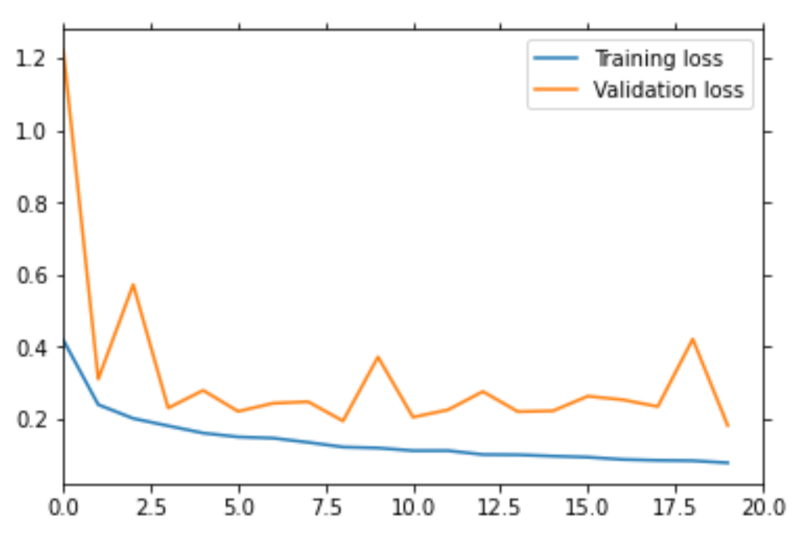
- Code - [train.py](train/train.py) <br>
    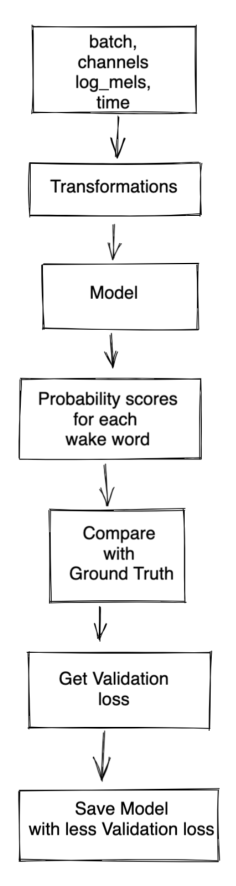

## Test Model
Below is how model performed on test dataset, model acheived 87% accuracy <br>
    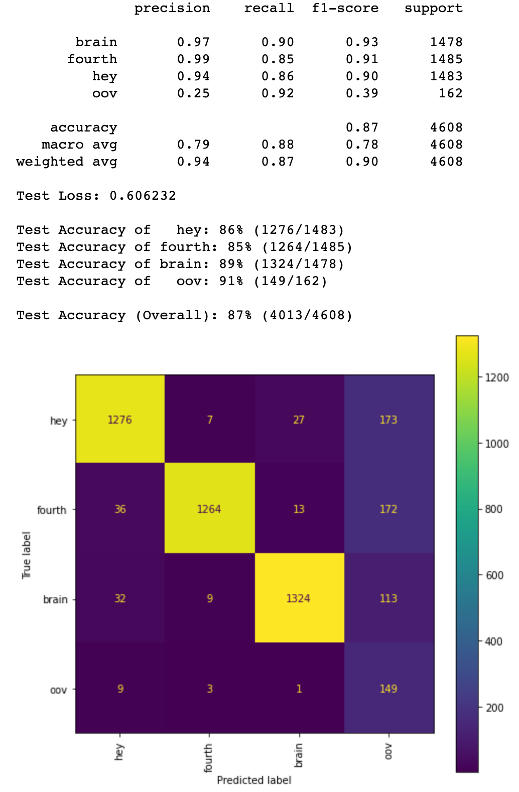
## Inference
Below are the methods used on live streaming audio on above model. 
### Using Pyaudio
- Used [Pyaudio](https://pypi.org/project/PyAudio/), to get input from microphone
- Capture 750ms window of audio buffer 
- After n batches, do transformations and infer on model
- Code - [infer.py](train/infer.py) <br>
- 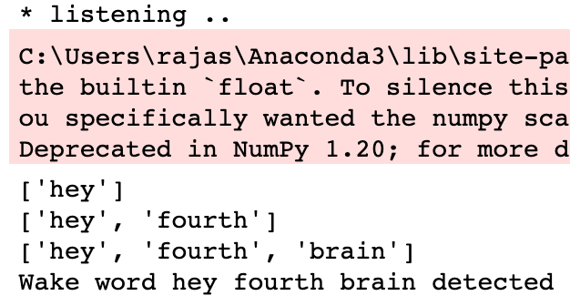
### Using web sockets
- Used [Flask Socketio](https://flask-socketio.readthedocs.io/en/latest/) at server level to capture audio buffer from client. 
- At Client, used [socket.io](https://socket.io/docs/v4/client-installation/) at client level to send audio buffer through socket connection.
- Capture audio buffer using [getUserMedia](https://developer.mozilla.org/en-US/docs/Web/API/Navigator/getUserMedia), convert to array buffer and stream to server.
- Inference will happen at server, after n batches of 750ms window
- If sequence detected, send detected prompt to client. <br>
    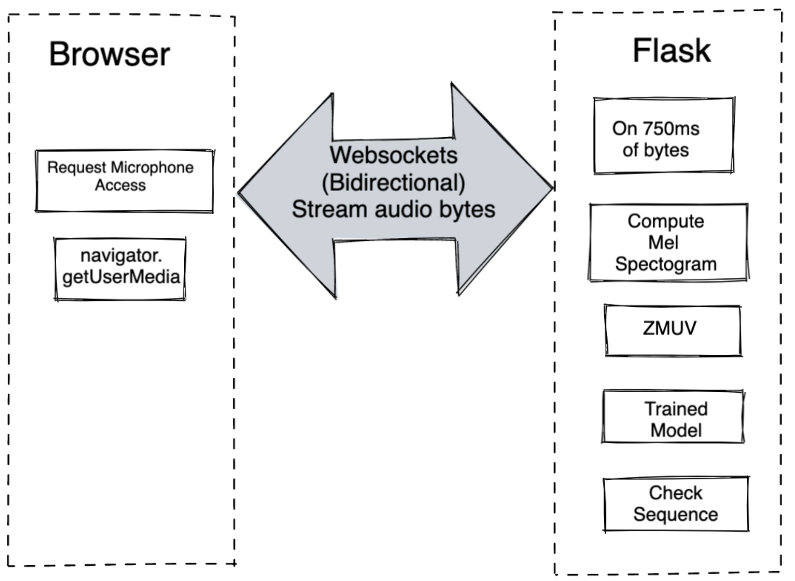
- Server Code - [application.py](server/application.py)
- Client Code - [main.js](server/static/audio/main.js)
- To run this locally 
    ```
    cd server
    python -m venv .venv
    pip install -r requirements.txt
    FLASK_ENV=development FLASK_APP=application.py .venv/bin/flask run --port 8011
    ```
    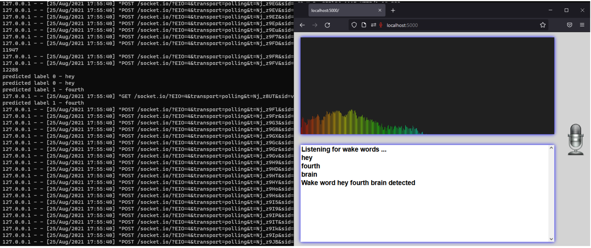
- Use [Dockerfile](server/Dockerfile) & [Dockerrun.aws.json](server/Dockerrun.aws.json) to containerize the app and deploy to [AWS Elastic BeanStalk](https://aws.amazon.com/elasticbeanstalk/)
- Elastic Beanstalk initialize app
    ```
    eb init -p docker-19.03.13-ce wakebot-app --region us-west-2
    ```
- Create Elastic Beanstalk instance
    ```
    eb create wakebot-app --instance_type t2.large --max-instances 1
    ```
- Disadvantage of above method might be of privacy, since we are sending the audio buffer to server for inference
### Using ONNX
- Used [Pytorch onnx](https://pytorch.org/docs/stable/onnx.html) to convert pytorch model to onnx model
- Pytorch to onnx convert code - [convert_to_onnx.py](server/utils/convert_to_onnx.py)
- Once converted, onnx model can be used at client side to do inference
- Client side, used [onnx.js](https://github.com/microsoft/onnxjs) to do inference at client level
- Capture audio buffer at client using [getUserMedia](https://developer.mozilla.org/en-US/docs/Web/API/Navigator/getUserMedia), convert to array buffer
- Used [fft.js](https://github.com/indutny/fft.js/blob/master/dist/fft.js) to compute [Fourier Transform](https://en.wikipedia.org/wiki/Fourier_transform)
- Used methods from [Meganta.js audio utils](https://github.com/magenta/magenta-js/blob/master/music/src/core/audio_utils.ts) to compute audio transformations like Mel spectrograms
- Below is the comparision of client side vs server side audio transformations <br>
    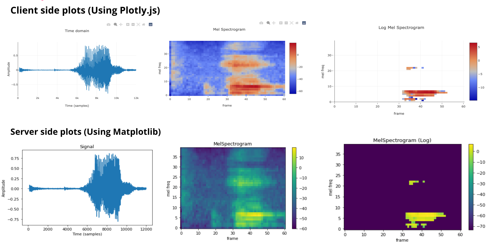
- Client side code - [main.js](standalone/static/audio/main.js)
- To run locally 
    ```
    cd standalone
    python -m venv .venv
    pip install -r requirements.txt
    FLASK_ENV=development FLASK_APP=application.py .venv/bin/flask run --port 8011
    ```
    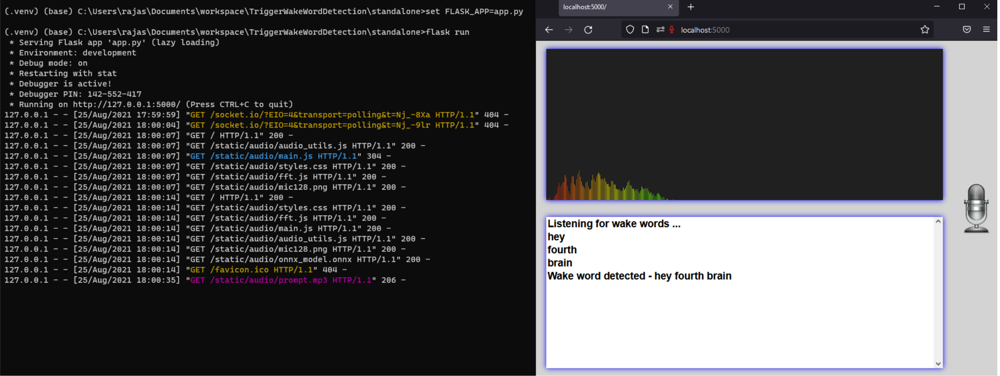
- To deploy to AWS Elastic Beanstalk, first initialize app
    ```
    eb init -p python-3.7 wakebot-std-app --region us-west-2
    ```
- Create Elastic Beanstalk instance
    ```
    eb create wakebot-std-app --instance_type t2.large --max-instances 1
    ```
- Refer [standalone_no_flask](standalone_no_flask) for client version without flask, you can deploy on any static server, you can also deploy to [IPFS](https://ipfs.io/)
- Recent version will show, plots and audio buffer for each wake word which model infered for, click on wake word button to know what buffer was infered for that word. 
    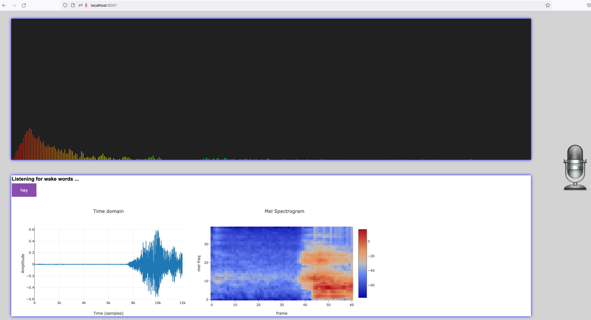
# Conclusion
In this project, we have went through how to extract audio features from audio and train model and detect wake words by using end to end example with source code. Go through [wake_word_detection.ipynb](notebooks/wake_word_detection.ipynb) jupyter notebook for complete walk through of this project. 


# Enhancements
- Explore different number of mels, in this project we used 40 as number of mels, we can use different number to see whether this will improve accuracy or not, this can be in range of 32 to 128.
- Use RNN or LSTM or GRU or attention to see whether we can get better results
- Check by computing MFCCs (which is computed after Mel spectrograms) and see if we see any improvements. 
- Use different audio augmentation methods like [TimeStrech, TimeMasking, FrequencyMasking](https://pytorch.org/tutorials/beginner/audio_preprocessing_tutorial.html#specaugment)